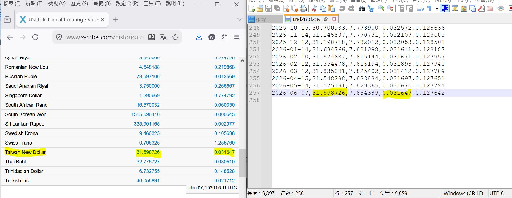

# python_usd-ntd-x-rate

## fetch historical USD exchange rate

ULR, 10years of data could be fetched.
```
https://www.x-rates.com/historical/?from=USD&amp;amount=1&amp;date=2026-06-07
```


### install following library first
```
pip install pandas requests beautifulsoup4
```

### works flow
```
## fetch historical USD exchange rate, https://www.x-rates.com/historical/?from=USD&amount=1&date=2026-06-07
## open (usd2ntd.csv)
## fetch 4 values of USD related if not ready, skip te date if not empty, go to next,
## appends to date for each value,
## save file (usd2ntd.csv)
```

### run the code
```
python usd2ntd.py
```

### the result

  
